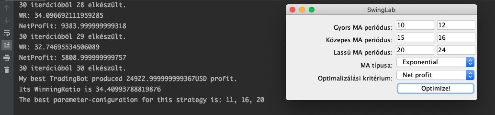

# Manuális tesztelés

### Feladat kijelölése
Program tesztelése más több, különböző formátumú adathalmazzal

### Részletes leírás
    A program alapvetően kizárólag .csv fájlokból tudott adatot olvasni, ezért készítettem hozzá
    egy JSON formátumú input olvasására alkalmas osztályt. Emellett bevezettem egy közös absztrakt
    osztályt az új json olvasó és a már meglévő csv olvasó osztálynak, illetve megoldottam, hogy a
    program ne beégetve tartalmazza, hogy melyik osztályt és milyen fájlt használjon inputnak, 
    hanem konstruktorparaméterként kapja meg a felelős osztály.
    A feladat kidolgozása során egy fontos bugot találtunk a Trader osztály trade függvényében. A metódusban
    lévő iteráció leállási feltétele nem a legnagyobb idősíkot vette figyelembe, ezért a program az eredeti példa
    inputtól eltérő bemenetre hibát dobott és leállt. Az eredeti adathalmaz esetében a 15 perces tőzsdei 
    gyertya záró dátuma éppen egybe esett a napi gyertya záró dátumával, ezért iebben az esetben nem jelentkezett
    a hiba, viszont az újonnan felvett json olvasó tesztelésekor használt adat esetében probléma volt. A hibát
    sikerült kijavítani, a program helyesen működik json formátummal is.
    
    A hiba kijavítása után néhány inputtal teszteltük az eredeti adathalmazon és az új json adathalmazon is 
    a programot néhány bemenettel.

#### csv bemenet tesztelése (20,21), (50,50), (150, 150) paraméterekkel:

- A program helyesen lefutott és az elvárt eredményt adta vissza, maximalizálta a paraméterek
alapján a nettó profitot (amely jelen esetben negatív).

#### csv bemenet tesztelése (20,21), (50,50), (150, 150) paraméterekkel:

- A program szintén gond nélkül futott és feltehetőleg helyes eredményt adott vissza.

#### csv bemenet tesztelése (10,12), (15,16), (20, 24) paraméterekkel:

- Ebben az esetben az egyszerű mozgó átlag helyett az exponenciális mozgó átlag alapján optimalizálta
a program a profitot, szintén sikeresen.

    A json bemenet tesztelésekor további problémákba ütköztünk amiatt, hogy az alkalmazásba
    mélyen bele volt égetve a minta csv adat használata, ezért további módosításokra volt 
    szükség a Trader osztály trade() függvényében. A függvénytörzs elején a program inicializált
    három dátum típusú változót, amelyek értéke erősen függ a bemeneti adathalmaztól. 
    Ezeknek a változóknak a megváltoztatása nélkül a program nem tud helyeen működni tetszőleges
    adathalmazon, kizárólag a minta adatfájlon. A JSON formátumú bemenetek tesztelése érdekében
    módosítottuk ezeket a változókat, tesztelés után pedig kommentben ott hagytuk a kódsorokat
    a tesztek reprodukálásának érdekében.

#### json bemenet tesztelése (5, 10), (20,25), (30,30) paraméterekkel:
- A program sikeresen maximalizálta a profitot és helyesen futott ebben az esetben is.

#### json bemenet tesztelése (3,13), (15,22), (25,35) paraméterekkel
- Itt nagyobb paraméterteret kellett bejárnia a programnak, de itt is sikeresen maximalizálta
a profitot

#### json bemenet tesztelése (6,12), (15,25), (30,40) paraméterekkel
- Exponenciális mozgó átlagot használva, győzelmi rátát maximalizálva is jól működött a program.

    A manuális tesztek alapján tanulságként azt szűrtük le a programról, hogy helyesen működik, ha
    sikerül elindítani és működésre bírni az általunk válaszott adathalmazzal, azonban elég rugalmatlan
    abból a szempontból, hogy milyen bemeneteket tud fogadni, mivel sokat kellett változtatni a kódon
    azért, hogy a saját, json formátumú adatunkon is tudjon dolgozni.

    

